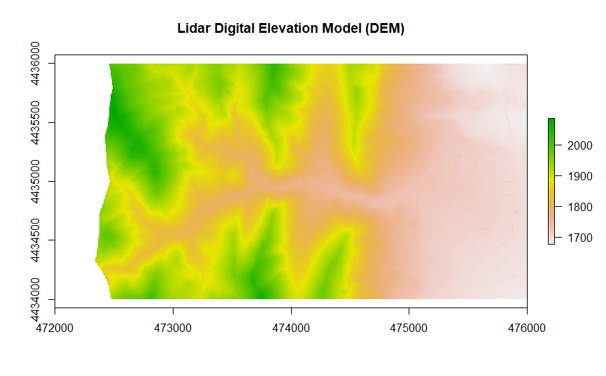
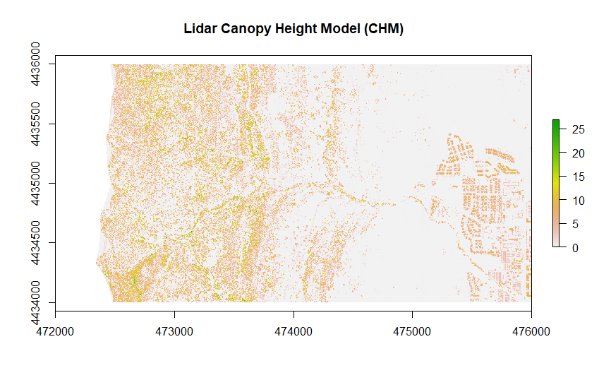
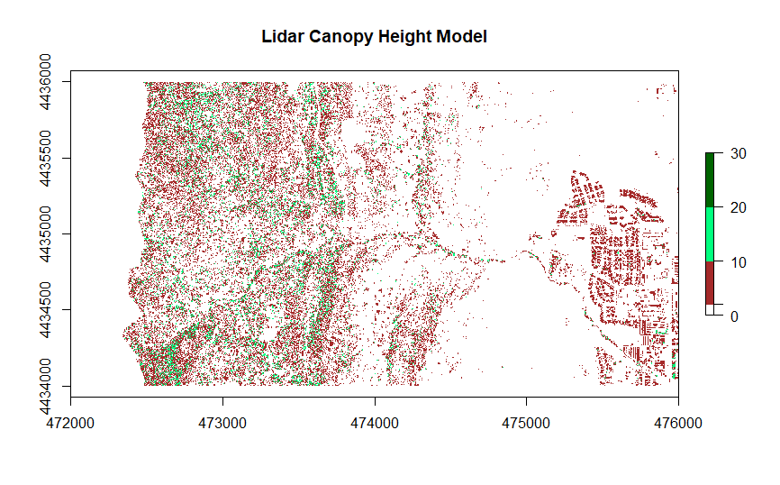
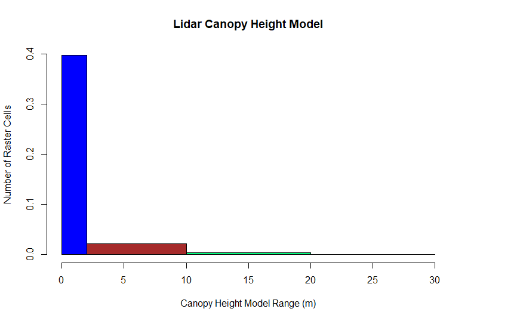
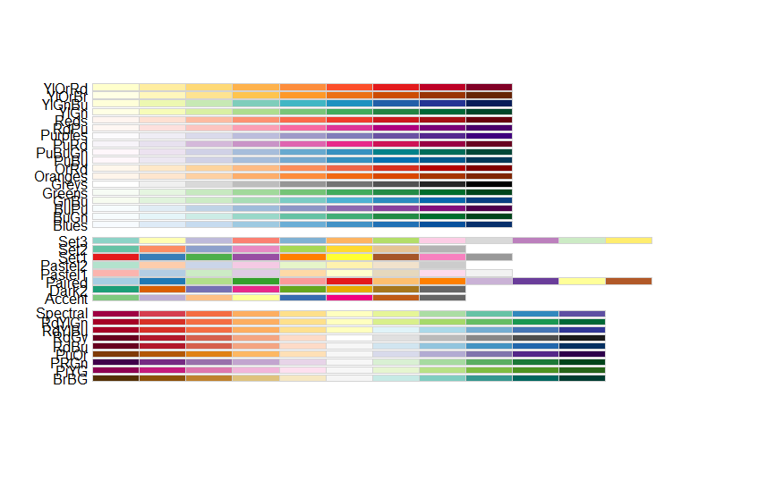
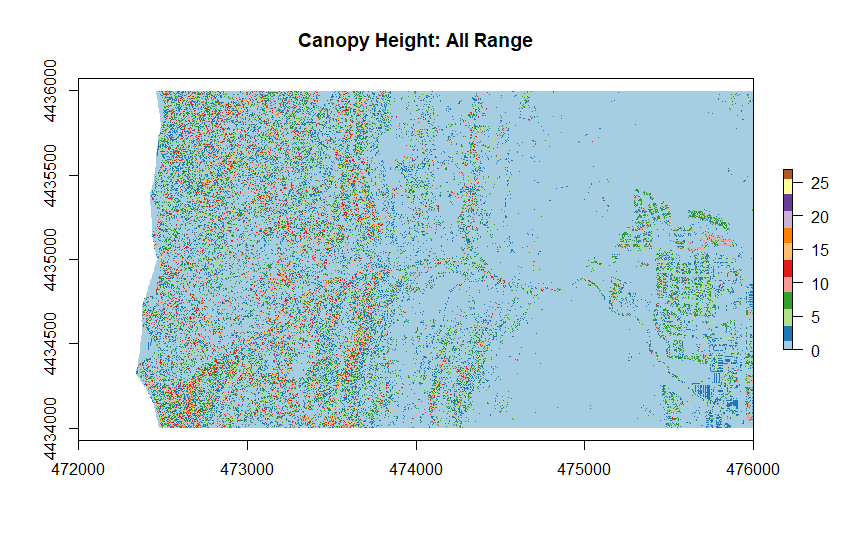
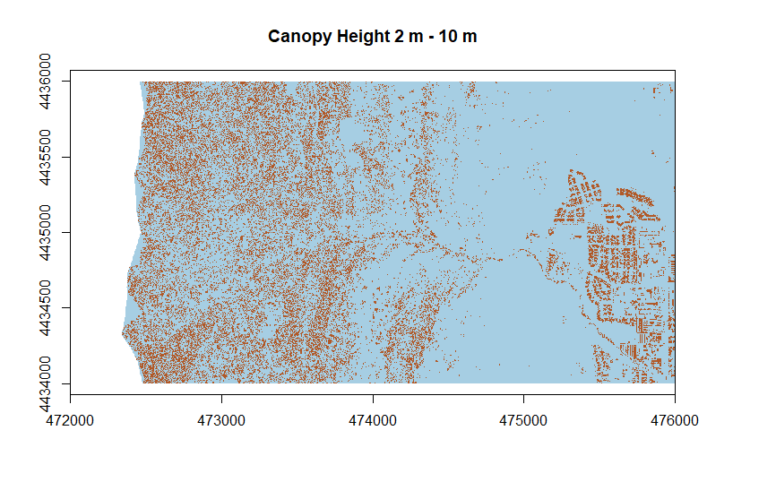
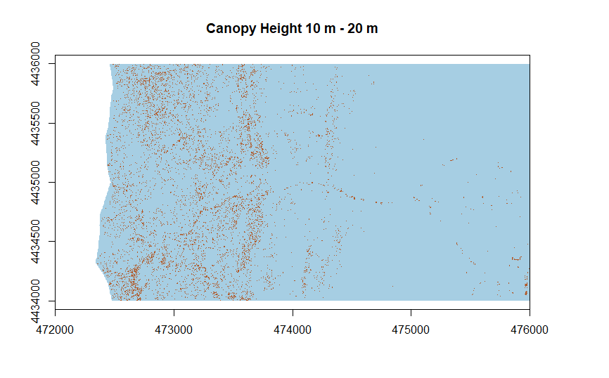
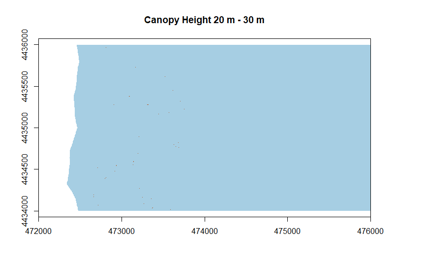
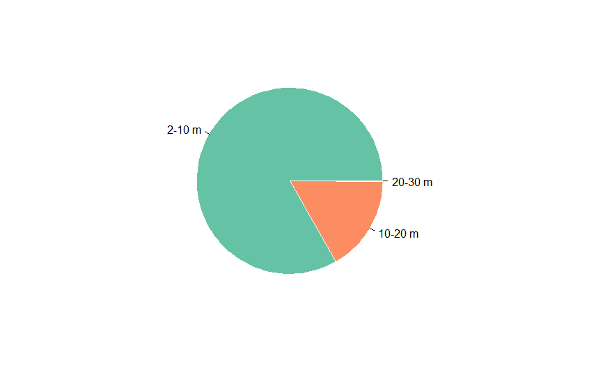

# Canopy-Height-Model-With-Lidar-Data

## Study Area: Pine Brook Hill, Colorado, USA
## Data source: Earth Data

### Load libraries
```
library(raster)
library(rgdal)
```

## Digital Elevation Model (DEM) or Digital Terrain Model (DTM)
### Open DTM raster data
```
lidar_dem <- raster(x = "C:/Users/konla/Desktop/EarthLab/Canopy-Height-Model-With-Lidar-Data/earthanalyticswk3/BLDR_LeeHill/pre-flood/lidar/pre_DTM.tif")
```

### Plot DEM
```
plot(lidar_dem,
     main = "Lidar Digital Elevation Model (DEM)")
```
<!-- -->

## Digital Surface Model (DSM)
### Open DSM raster data
```
lidar_dsm <- raster(x = "C:/Users/konla/Desktop/EarthLab/Canopy-Height-Model-With-Lidar-Data/earthanalyticswk3/BLDR_LeeHill/pre-flood/lidar/pre_DSM.tif")
```

### Plot DSM
```
plot(lidar_dsm,
     main = "Lidar Digital Surface Model (DSM)")
```
<!-- -->


## Canopy Height Model (CHM)
```
DSM - DEM = CHM

DSM = Digital Surface Model
DEM = Digital Elevation Model
CHM = Canopy Height Model
```

### CHM Calculation
```
lidar_chm <- lidar_dsm - lidar_dem
```

### Plots CHM
```
plot(lidar_chm,
     main = "Lidar Canopy Height Model (CHM)")
```
<!-- -->

### Plots Using Breaks
```
plot(lidar_chm,
     breaks = c(0, 2, 10, 20, 30),
     main = "Lidar Canopy Height Model",
     col = c("white", "brown", "springgreen", "darkgreen"))
```
<!-- -->


```
hist(lidar_chm,
     breaks = c(0, 2, 10, 20, 30),
     main = "Lidar Canopy Height Model",
     col = c("blue", "brown", "springgreen", "darkgreen"),
     xlab = "Canopy Height Model Range (m)",
     ylab = "Number of Raster Cells")
```
<!-- -->

### Set up the Color from RColorBrewer
```
library(RColorBrewer)
display.brewer.all()
color = brewer.pal(n = 20, name = "Paired")
```
<!-- -->

### Plot different range

#### Canopy Height Model: All Range
```
plot(lidar_chm, col = color, main = "Canopy Height: All Range")
```
<!-- -->

#### Canopy Height Model: 2 - 10 m
```
plot(lidar_chm >= 2 & lidar_chm <= 10, main = "Canopy Height 2 m - 10 m", col = color, legend = F)
```
<!-- -->


#### Canopy Height Model: 10 - 20 m
```
plot(lidar_chm >= 10 & lidar_chm <= 20, main = "Canopy Height 10 m - 20 m", col = color, legend = F)
```
<!-- -->


#### Canopy Height Model: 20 - 30 m
```
plot(lidar_chm >= 20 & lidar_chm <= 30, main = "Canopy Height 20 m - 30 m", col = color, legend = F)
```
<!-- -->


### Canopy Height Model raster information
```
lidar_chm

class      : RasterLayer 
dimensions : 2000, 4000, 8e+06  (nrow, ncol, ncell)
resolution : 1, 1  (x, y)
extent     : 472000, 476000, 4434000, 4436000  (xmin, xmax, ymin, ymax)
crs        : +proj=utm +zone=13 +datum=WGS84 +units=m +no_defs 
source     : memory
names      : layer 
values     : 0, 26.93005  (min, max)
```

### Number of Raster cell in Canopy Height Model data
```
ncell(lidar_chm)

[1] 8000000
```
## Number of cell of different range

### Number of Raster cell which has value more than or equal to 0
```
length(which(values(lidar_chm) >= 0))

[1] 7157728
```

### Canopy Height Model: 0 m
```
length(which(values(lidar_chm) == 0))

[1] 4203499
```

### Canopy Height Model: Greater than 0 m
```
length(which(values(lidar_chm) >= 0))

[1] 7157728
```
### Canopy Height Model: 0 - 2 m
```
length(which(values(lidar_chm) > 0 & values(lidar_chm) <= 2))

[1] 1491326
```

### Canopy Height Model: 2 - 10 m
```
length(which(values(lidar_chm) > 2 & values(lidar_chm) <= 10))

[1] 1217191
```

### Canopy Height Model: 10 - 20 m
```
length(which(values(lidar_chm) > 10 & values(lidar_chm) <= 20))

[1] 244055
```

### Canopy Height Model: 20 - 30 m
```
length(which(values(lidar_chm) > 20 & values(lidar_chm) <= 30))

[1] 1657
```

### Canopy Height Model: Greater than 30 m
```
length(which(values(lidar_chm) >= 30))

[1] 0
```

### Average Canomy Height

```
mean(values(lidar_chm), na.rm = TRUE)

[1] 1.428235
```

## Outlier 0 m Height 

```
lidar_chm[lidar_chm == 0] <- NA
length(which(values(lidar_chm) == 0))

[1] 0
```
### Average Canopy Height exclude 0 m 
```
mean(values(lidar_chm), na.rm = TRUE)

[1] 3.460434
```
### Create Data Frame to Store number of cell of different range

#### Declare Data Frame
```
range_canopy = data.frame(matrix(ncol = 5, nrow = 1))
c = c("0-2 m","2-10 m", "10-20 m", "20-30 m", "Sum")
colnames(range_canopy) = c
```

#### Store the value
```
range_canopy[1,1] = length(which(values(lidar_chm) > 0 & values(lidar_chm) <= 2))
range_canopy[1,2] = length(which(values(lidar_chm) > 2 & values(lidar_chm) <= 10))
range_canopy[1,3] = length(which(values(lidar_chm) > 10 & values(lidar_chm) <= 20))
range_canopy[1,4] = length(which(values(lidar_chm) > 20 & values(lidar_chm) <= 30))
range_canopy[1,5] = sum(range_canopy[1,1:4])
```
### Prepare a color palette. Here with R color brewer:
```
library(RColorBrewer)
myPalette <- brewer.pal(5, "Set2") 
```

### Pie Chart
```
Prop = c(range_canopy[1,2], range_canopy[1,3], range_canopy[1,4])

# You can change the border of each area with the classical parameters:
pie(Prop , labels = c("2-10 m","10-20 m","20-30 m"), border="white", col=myPalette )
```

<!-- -->
